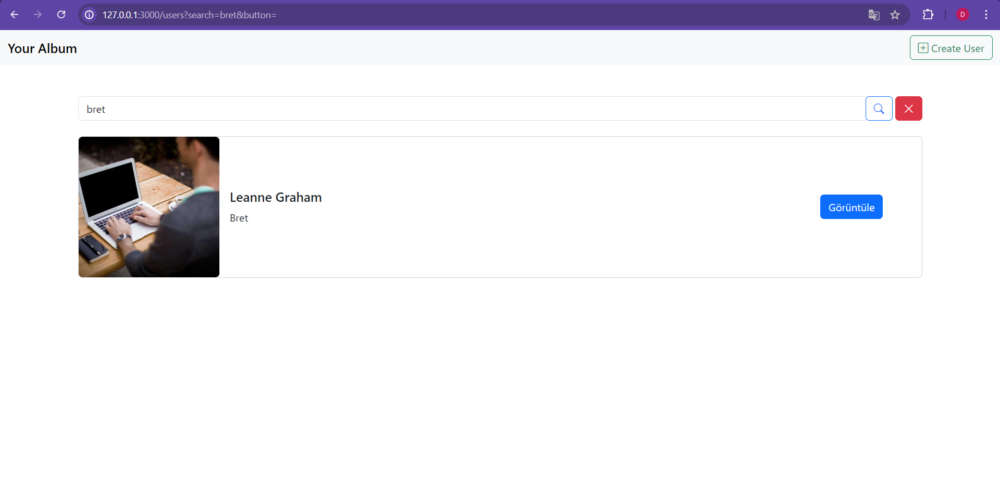
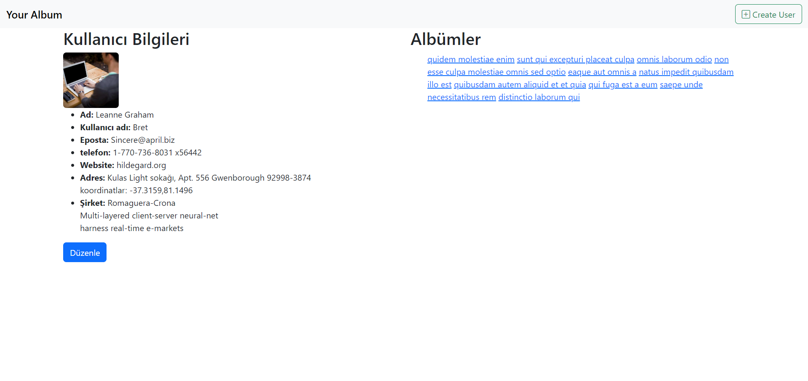
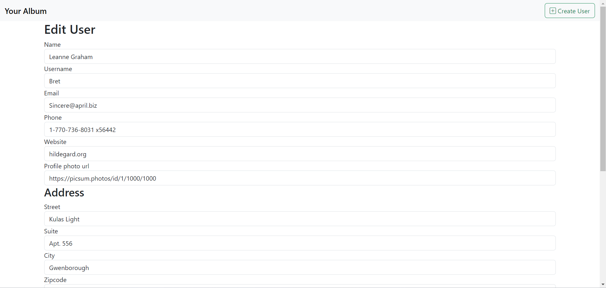

# Iwallet Ror Bootcamp Bitirme Projesi - YourAlbum
Bu proje IwalletxPatika Dev Ruby on Rails Bootcamp sonu bitirme projesidir. Bu proje
* Kullanıcı oluşturma,
* Kullanıcılar listeleme
* Kullanıcı detayları görüntüleme
* Kullanıcı Düzenleme
* Kullanıcıya ait albümleri görüntüleme
* Kullanıcı arama  

işlevlerini gerçekleştirmektedir.  
Projede
* Ruby on Rails
* Postgresql
* Bootstrap

Teknolojileri kullanılmıştır. 

Uygulamada model ve controller testleri ile işlemlerin güvenliği sağlanmıştır. 
## Veri Tabanı Mimarisi
### Users Tablosu
    "name": String
    "username": String
    "email": String
    "phone": String
    "website": String
    "profile_photo_url": String
    "created_at": datetime
    "updated_at": datetime
### Addresses tablosu
    "street": String
    "suite": String
    "city": String
    "zipcode": String
    "user_id": Bigint, fk:users
    "created_at": Datetime
    "updated_at": Datetime
### Geos Tablosu
    "lat": float
    "lng": float
    "address_id": Bigint, fk: addresses
    "created_at": Datetime
    "updated_at": Datetime
### Companies Tablosu
    "name": String
    "catchPhrase": String
    "bs": String
    "user_id": Bigint, fk: users
    "created_at": Datetime
    "updated_at": Datetime
### Albums Tablosu
    "title": String
    "user_id": Bigint, fk: users
    "created_at": Datetime
    "updated_at": Datetime
### Album_details tablosu
    "title": String
    "url": String
    "thumbnail_url": String
    "album_id": Bigint, fk: albums
    "created_at": Datetime
    "updated_at": Datetime

## Proje kurulumu

İlk olarak tüm gemlerin yüklendiğinden emin olmak için ``` bundle install ``` komutu ile gemleri yükleyebiliriz.   
Veri tabanını oluşturmadan önce /config/database.yml dosyasından veri tabanı yapılandırmamızı yapabiliriz. Ardından ``` rails db:create ``` komutu ile veri tabanımızı oluşturabiliriz. Veri tabanı tablolarımızı migration ile oluşturmak için ``` rails db:migrate ``` komutunu çalıştırabiliriz. 

Proje varsayılan kullanıcılar olarak https://jsonplaceholder.typicode.com/users adresindeki kullanıcıları çeker. https://picsum.photos/id/{id}/info adresinden kullanıcı idsine göre kullanıcı resimlerini belirler. Kullanıcıların albümleri bulunmaktadır ve albümler https://jsonplaceholder.typicode.com/albums adresinden çekilir. https://jsonplaceholder.typicode.com/photos Albüm detay bilgileri ise bu adreste yer almaktadır. 

Uygulama bu işlemleri railsteki tasks aracılığıyla gerçekleştirir.  
Varsayılan user bilgilerini kaydetmek için 
```rake fetch:users```  
albüm bilgileri için ```rake fetch:albums```  
albüm detayları için ```rake fetch:album_details```  
komutları ile veri tabanına kayıt edilir. 

Bu işlemler sonunda ```rails s``` komutu ile proje başlatılabilir. 

## Controller Tanıtımı
### Users Controller
Controllerda user parametrelerini set edebilmek için user_params fonksiyonu vardır. User bulmak için set_user fonksiyonu vardır. set_user show, edit ve update fonksiyonlarında kullanılır. 
#### Index
Burada eğer arama işlemi varsa aranan sonuç gösterilir yoksa tüm kullanıcılar gösterilir. Arama işlemi ILIKE ile yapıldığı için büyük/küçük harf farketmezsizin arama tamamlanır. 
#### Show
İlgili userın sayfasını göstermek için kullanılır. @user ve o usera ait albümler @album olarak tanımlanır. 
#### New
Yeni kullanıcı formunun gösterildiği kısımdır. Yeni kullanıcı oluşturulurken user, address, geo ve company de oluşturulacağından o formlar da yüklenir. 
#### Edit
Kullanıcı güncelleme formunun gösterildiği kısımdır. 
#### Create
Yeni kullanıcı oluşturma işlemi gerçekleştirilir. Bu işlemde hata olması durumunda hata gösterilir. Başarı durumunda başarı mesajı gösterilir. 
#### Update
Kullanıcı güncelleme işlemi gerçekleştirilir. Bu işlemde hata olması durumunda hata gösterilir. Başarı durumunda başarı mesajı gösterilir. 
### Albums Controller
Album bulmak için set_album fonksiyonu vardır. set_album show fonksiyonunda kullanılır 
#### Show
İlgili albümün sayfasını göstermek için kullanılır. @album ve o albüme ait albüm detayları @album_details olarak tanımlanır. 
## Proje Senaryosu
Kurulum adımları tamamlandıktan sonra proje başlatıldığında aşağıdaki sayfa yüklenir. 


Ardından arama işlemini aşağıdaki resimdeki gibi gerçekleştirebiliriz. Burada büyüteçe tıkladığımızda arama işlemi büyük/küçük harf farketmezsizin uygulanır. Çarpı butonuna basıldığında arama temizlenir. 



Kişi kartlarındaki görüntüle butonuna basıldığında aşağıdaki gibi bir sayfa açılır. 



Buradaki düzenle butonuna basıldığında kişi düzenleme formu açılır. 



Yapılan başarılı güncelleme sonucunda kullanıcı sayfasına yönlendirilir ve başarı mesajı görüntülenir. Bu örnekte ad kısmı güncellenmeştir. 


Albümlere tıklanıldığında şekildeki gibi bir pop-up ile albüm detayları görüntülenir. 


Burası en altta bulunan (Bu resimde görünmüyor, ekran kaydırılarak aşağıya inilebilir) buton ile kapatılabilir. Kullanıcı oluşturma işlemine bakacağımız zaman Navbardaki Create User butonuna basıldığında aşağıdaki sayfa açılır. 


Burada null değer kontrolü yapılır ve null değerler varsa aşağıdaki sayfa yüklenir. 


Yeni kullanıcı oluştururken profil fotoğrafı boş seçilirse aşağıdaki gibi default profil fotoğrafı eklenir. 


Arama kısmına bulunmayan bir kullanıcının kullanıcı adı yazıldığında bu şekilde bir sonuç döner. 


Uygulama aşağıdaki resimdeki gibi responsive bir tasarıma sahiptir. 


